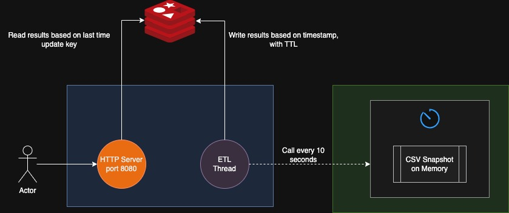
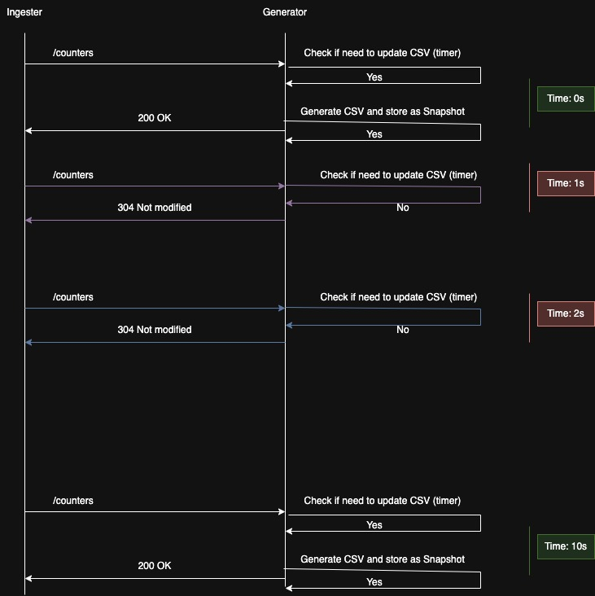
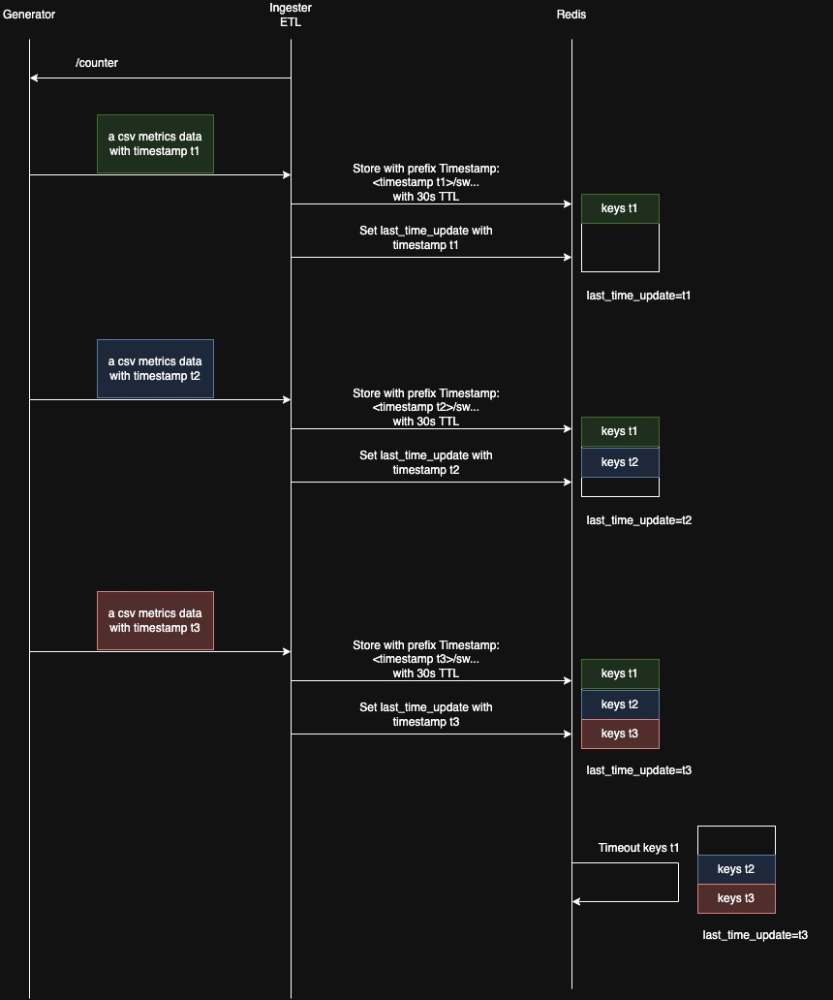

# Telemetry Infrastructure

## About

This project provides a high-performance telemetry infrastructure for network metrics management. It consists of two main services:

- **Generator**: Simulates network switches and generates telemetry data, sending metrics to the ingester service for testing and demonstration purposes.

- **Ingester**: Receives, processes, and stores telemetry data from switches (or the generator) via HTTP APIs, with a Redis-backed storage layer for efficient data retrieval.

The system is designed to handle thousands of concurrent requests with low latency, making it suitable for real-time network monitoring and analytics applications.

## Getting Started

### Prerequisites

- Docker and Docker Compose installed on your system
- No additional dependencies required (all services run in containers)

### Running the System

**Build and start all services:**
```bash
docker-compose up --build
```
This command will:
- Build Docker images for both Generator and Ingester services
- Start Redis container
- Start Generator service on port 9001
- Start Ingester service on port 8080
- The Ingester will automatically begin pulling data from the Generator via the background ETL pipeline

### Testing the APIs

Once the system is running, you can test the endpoints:

**List all metrics:**
```bash
curl "http://localhost:8080/telemetry/ListMetrics"
```

**Get a specific metric:**
```bash
curl "http://localhost:8080/telemetry/GetMetric?switch_id=sw1&metric=latency_ms"
```

## Key Features & Technical Highlights

### High-Performance Architecture
- **Stateless Microservices Design**: Both services are designed to be completely stateless, storing all state externally in Redis. This architecture enables horizontal scaling by running multiple instances of each service in a cluster without coordination overhead, making it ideal for cloud-native and microservices deployments.

- **Fast HTTP Server**: Optimized for high throughput with non-blocking I/O operations, achieving 15,000+ requests/sec for point queries and 3,000+ requests/sec for bulk operations with sub-20ms average latency.

- **Lock-Free Concurrency**: The ingester service is designed without traditional locking mechanisms, utilizing Go's goroutines and channels for safe concurrent operations, eliminating contention and improving scalability under heavy load.

- **Non-Blocking Operations**: All I/O operations are non-blocking, leveraging Redis pipelining for batch operations and SCAN instead of blocking KEYS commands, ensuring the system remains responsive under high concurrency.

### Data Ingestion & Processing
- **Background ETL Pipeline**: Runs in a separate goroutine (thread) with a pull-based architecture where the ingester periodically fetches data from the generator without blocking the HTTP server. Features include:
  - **Streaming CSV parsing**: Memory-efficient line-by-line processing instead of loading entire responses into memory

  - **HTTP 304 optimization**: Respects `Not Modified` responses to skip unnecessary processing and reduce bandwidth

  - **Time-based partitioning**: Redis keys use `{timestamp}/{switch_id}` format enabling efficient range queries and time-series operations

  - **Fault tolerance**: Continues processing even if individual records fail, with detailed error tracking and logging

  - **Smart timestamping**: Tracks last update time in Redis for efficient incremental queries

### Data Storage & Retrieval
- **Redis Backend**: Utilizes Redis as the primary data store for metrics, chosen specifically to enable stateless microservices architecture. By externalizing all state to Redis, the services can scale horizontally across multiple instances without coordination. Provides low-latency access with efficient key-value operations, and implements Redis pipelining to reduce round-trips and batch fetch operations for optimal performance.

### Reliability & Quality Assurance
- **Integration Tests**: Full test coverage for all use cases including edge cases, error scenarios, and concurrent operations. 
Tests validate end-to-end functionality to prevent regressions and ensure system reliability.
- **Error Handling**: Proper HTTP status codes for all scenarios (400 for bad requests, 404 for not found, 500 for server errors), with detailed error messages. 
All error paths are handled gracefully without panics or undefined behavior.
- **Logging**: Informative logs at appropriate levels (info, error) throughout the system, providing visibility into operations and errors for debugging and monitoring in production environments.

### Configuration Management
- **Centralized Configuration**: Each service has its own dedicated config package with all settings defined in a single location, making it simple to modify parameters without searching through code. Configuration includes server ports, Redis connection details, ETL intervals, cache TTLs, and data retention policies.
- **Environment-Based Configuration**: Follows 12-factor app principles with environment variable support, providing sensible defaults for local development while allowing easy overrides for Docker and production environments.

### Deployment & Development
- **Docker Support**: Complete containerization with Docker Compose orchestration, enabling easy deployment of both services (generator and ingester) along with Redis. Supports development, testing, and production environments with consistent behavior.

## Design and Architecture

### High-Level Design

The system follows a distributed architecture with three main components:


**Architecture Overview:**
- **Generator Service**: Simulates network switches and generates telemetry data in CSV format. Implements smart caching with HTTP 304 responses to optimize bandwidth.
- **Ingester Service**: Pulls data from the generator via HTTP, processes it through a background ETL pipeline, and serves query requests through RESTful APIs.
- **Redis**: Acts as the central data store, providing fast key-value access for metric storage and retrieval.

### Detailed Architecture



**Component Breakdown:**

**Generator Service:**
- **HTTP Server**: Exposes REST API endpoint for telemetry data retrieval
- **CSV Generator**: Creates metric records in CSV format with configurable switch IDs and metric types
- **Cache Manager**: Implements time-based caching (TTL) with thread-safe, returns HTTP 304 when data hasn't changed
- **Config**: Centralized configuration for server port, cache TTL, and data generation parameters

**Ingester Service:**
- **HTTP Server**: Serves two main API endpoints:
  - `GetMetric`: Retrieves specific metric for a switch
  - `ListMetrics`: Returns all metrics with optional filtering by last update time
- **ETL Pipeline**: Background goroutine that:
  - Periodically pulls data from Generator via HTTP (configured to 10s)
  - Parses CSV stream line-by-line for memory efficiency
  - Validates and transforms data before storage
- **Config**: Centralized configuration for server port, Redis connection, ETL interval, and data retention

**Data Flow:**
1. **Data Generation**: Generator creates metrics in CSV format and stores them as a snapshot for 10 seconds (configurable)
2. **ETL Pull**: Ingester's background pipeline periodically requests data from Generator
3. **Snapshot Check**: Generator returns either fresh snapshot data (200) or not modified (304) if snapshot hasn't expired
4. **Data Processing**: ETL parses CSV stream line-by-line, validates fields, and prepares records
5. **Storage**: DAO stores metrics in Redis with time-based keys and TTL
6. **Response**: Client queries hit the HTTP server, which retrieves data from Redis via DAO and returns metrics as JSON with streaming encoding

### Sequence Diagrams

#### Generator /counter Endpoint



<br>
<br>

#### Redis Key Storage and TTL Management



**TTL Strategy and Data Availability:**

The system uses a 30-second TTL for metrics while ingesting new data every 10 seconds. This 3x overlap is intentional and critical for ensuring continuous data availability.

**The Problem: Non-Atomic TTL Operations**

Redis TTL expiration and key insertion are not atomic operations. Without overlapping TTLs, there would be a race condition during data refresh:

1. Old keys expire at T=10s
2. ETL fetches new data (network latency + parsing time)
3. New keys are inserted at T=10.5s

During this 500ms window, `ListMetrics` queries would return incomplete or empty results, creating gaps in data availability.

**The Solution: Overlapping TTL Windows**

By setting TTL to 30 seconds (3x the ingestion interval), we maintain at least 2-3 generations of data in Redis simultaneously:

- **Generation 1**: T=0s, expires at T=30s
- **Generation 2**: T=10s, expires at T=40s
- **Generation 3**: T=20s, expires at T=50s

This overlap guarantees that data is always present, even during ETL delays, network issues, or generator downtime.

**Ordered Write Pattern:**

The ETL pipeline follows a specific write order to prevent partial reads:

1. **Insert all metric keys** with their values and TTL
2. **Update `last_time_updated` key** as the final operation

This ensures that the `last_time_updated` key always points to a complete dataset. If a client queries between steps 1 and 2, they receive the previous complete snapshot. Once step 2 completes, all subsequent queries return the new complete dataset. This pattern prevents clients from ever seeing partial or inconsistent data during updates.

## Why Redis?

I chose Redis as the storage layer for telemetry metrics because it fits the system's requirements for low-latency, high-frequency, real-time data access. The assignment expects the API server to serve updated metrics quickly, under concurrent load, without blocking — Redis enables exactly that.

### 1. Extremely Fast (In-Memory)

Telemetry updates occur every few seconds, and API requests must return in milliseconds. Redis is fully in-memory with sub-millisecond read/write operations, which ensures:

- **Constant-time lookup (O(1))**: Key-value operations are instantaneous
- **Predictable performance even under high concurrency**: No performance degradation as load increases
- **No disk I/O penalties**: All operations happen in RAM

### 2. Non-Blocking API Path

The API server reads pre-ingested values directly from Redis, so clients are never blocked by an ingestion cycle, CSV parsing, or data refresh:

- **Reads are independent from writes**: Query operations don't interfere with ETL pipeline
- **Ingestion can fail or delay without affecting serving path**: API remains responsive even if generator is down
- **Enables lock-free request handling**: Matches the system's lock-free concurrency design

### 3. Industry-Standard Cache for Real-Time Systems

Redis is the industry standard for fast, transient, frequently updated data especially for metrics and counters.

### 4. Built-In TTL Support

Telemetry is time-sensitive — old data becomes worthless. Redis allows storing each metric with a TTL, ensuring automatic expiration without manual cleanup logic:

- **Automatic memory management**: Old metrics are automatically removed
- **Configurable retention**: TTL can be adjusted based on requirements (default: 30 seconds)
- **No garbage collection overhead**: Redis handles expiration efficiently

### 5. Enables Stateless Microservices Architecture

By externalizing all state to Redis, the API server becomes fully stateless, which allows:

- **Horizontal scaling**: Run N API replicas with zero shared memory or coordination
- **Rolling deployments without data loss**: New instances immediately access shared state
- **No need for in-process locking**: All coordination happens through Redis
- **Better fault tolerance**: API crashes don't lose data — state persists in Redis

This stateless design enables the architecture to scale horizontally by simply adding more service instances, making it production-ready for cloud-native deployments.

## Performance Results

### Setup

To run the performance testing tool, you need to install `hey`:

```bash
go install github.com/rakyll/hey@latest
```

### Running Performance Tests

To run a performance test:

```bash
hey -n 5000 -c 50 http://localhost:8080/telemetry/<EP>
```

### Results

Results for 5000 requests with 50 client concurrency using the command:
```bash
hey -n 5000 -c 50 http://localhost:8080/telemetry/ListMetrics
```

```
Summary:
  Total:	1.5811 secs (1581.1 ms)
  Slowest:	0.0586 secs (58.6 ms)
  Fastest:	0.0024 secs (2.4 ms)
  Average:	0.0156 secs (15.6 ms)
  Requests/sec:	3162.3278

Response time histogram:
  0.002 [1]	|
  0.008 [15]	|
  0.014 [1392]	|■■■■■■■■■■■■■■■■■■
  0.019 [3127]	|■■■■■■■■■■■■■■■■■■■■■■■■■■■■■■■■■■■■■■■■
  0.025 [383]	|■■■■■
  0.031 [37]	|
  0.036 [1]	|
  0.042 [7]	|
  0.047 [20]	|
  0.053 [14]	|
  0.059 [3]	|

Latency distribution:
  10% in 0.0121 secs
  25% in 0.0134 secs
  50% in 0.0150 secs
  75% in 0.0170 secs
  90% in 0.0191 secs
  95% in 0.0209 secs
  99% in 0.0297 secs

Details (average, fastest, slowest):
  DNS+dialup:	0.0001 secs, 0.0024 secs, 0.0586 secs
  DNS-lookup:	0.0000 secs, 0.0000 secs, 0.0031 secs
  req write:	0.0000 secs, 0.0000 secs, 0.0042 secs
  resp wait:	0.0154 secs, 0.0024 secs, 0.0478 secs
  resp read:	0.0000 secs, 0.0000 secs, 0.0010 secs

Status code distribution:
  [200]	5000 responses
```

**Performance Optimizations Applied:**
- Replaced blocking Redis `KEYS` command with non-blocking `SCAN`
- Batch fetching using Redis Pipeline (single round-trip instead of N queries)
- Streaming JSON encoding to reduce memory allocation

---

Results for 5000 requests with 50 client concurrency using the command:
```bash
hey -n 5000 -c 50 "http://localhost:8080/telemetry/GetMetric?switch_id=sw5&metric=latency_ms"
```

```
Summary:
  Total:	0.3281 secs (328.1 ms)
  Slowest:	0.0130 secs (13 ms)
  Fastest:	0.0008 secs (0.8 ms)
  Average:	0.0032 secs (3.2 ms)
  Requests/sec:	15237.1506

  Total data:	30000 bytes
  Size/request:	6 bytes

Response time histogram:
  0.001 [1]	|
  0.002 [311]	|■■■■■
  0.003 [2752]	|■■■■■■■■■■■■■■■■■■■■■■■■■■■■■■■■■■■■■■■■
  0.004 [1590]	|■■■■■■■■■■■■■■■■■■■■■■■
  0.006 [274]	|■■■■
  0.007 [15]	|
  0.008 [16]	|
  0.009 [16]	|
  0.011 [10]	|
  0.012 [11]	|
  0.013 [4]	|


Latency distribution:
  10% in 0.0022 secs
  25% in 0.0026 secs
  50% in 0.0030 secs
  75% in 0.0037 secs
  90% in 0.0043 secs
  95% in 0.0047 secs
  99% in 0.0077 secs

Details (average, fastest, slowest):
  DNS+dialup:	0.0001 secs, 0.0008 secs, 0.0130 secs
  DNS-lookup:	0.0000 secs, 0.0000 secs, 0.0021 secs
  req write:	0.0000 secs, 0.0000 secs, 0.0021 secs
  resp wait:	0.0030 secs, 0.0008 secs, 0.0075 secs
  resp read:	0.0001 secs, 0.0000 secs, 0.0022 secs

Status code distribution:
  [200]	5000 responses
```
